#SimpleChat-简单的多功能聊天室
##作者信息
```
Project: SimpleChat
Author: Hurray Zhu
Time: 2014.10.28
E-mail: i@ihurray.com
Web-site: http://blog.ihurray.com
GitHub: https://github.com/Hurray0/ketang/tree/master/Distributional_Computing/lab1
```
##文件目录
```
.
|____build
| |____Client$1.class
| |____Client$ClientThreadInput.class
| |____Client$ClientThreadOutput.class
| |____Client$TextFieldListener.class
| |____Client.class
| |____makefile
| |____R.class
| |____Server.class
| |____Server_MainThread.class
| |____ServerMainThread.class
| |____ThreadCleanUserMap.class
|____build.xml
|____makefile
|____README.md
|____src
| |____Client.java
| |____R.java
| |____Server.java
| |____ServerMainThread.java
| |____ThreadCleanUserMap.java
```

##编码环境
* MacOS X

* 命令行编译运行

##运行环境及方法
###编译环境
* *unix(含MacOS) 使用makefile/Ant编译
* Windows使用Ant编译
* 或者按照R.java Client.java Server_MainThread.java ThreadCleanUserMap.java Server.java的顺序依次编译src文件夹的文件，然后java命令运行

###例图
####makefile自动编译
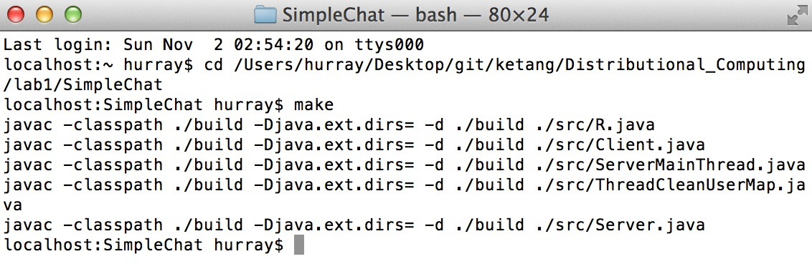

####ant自动编译
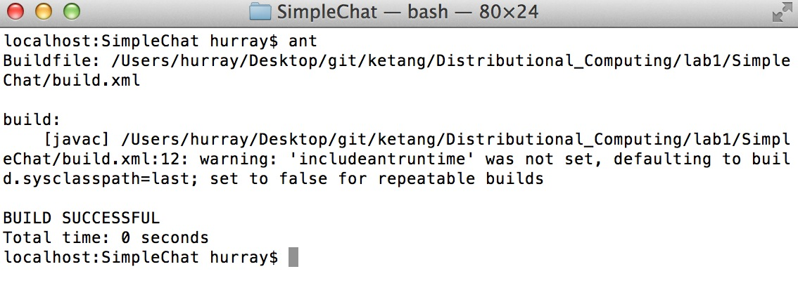

####运行服务器(在build目录中用make server命令也可)
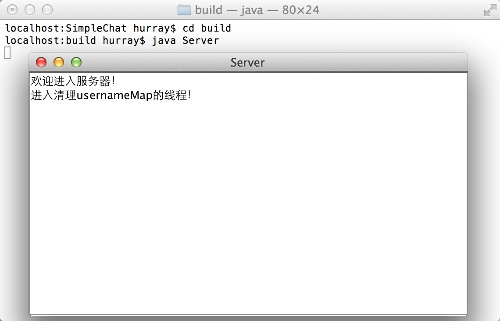

####运行客户端(在build目录中用make client命令也可)

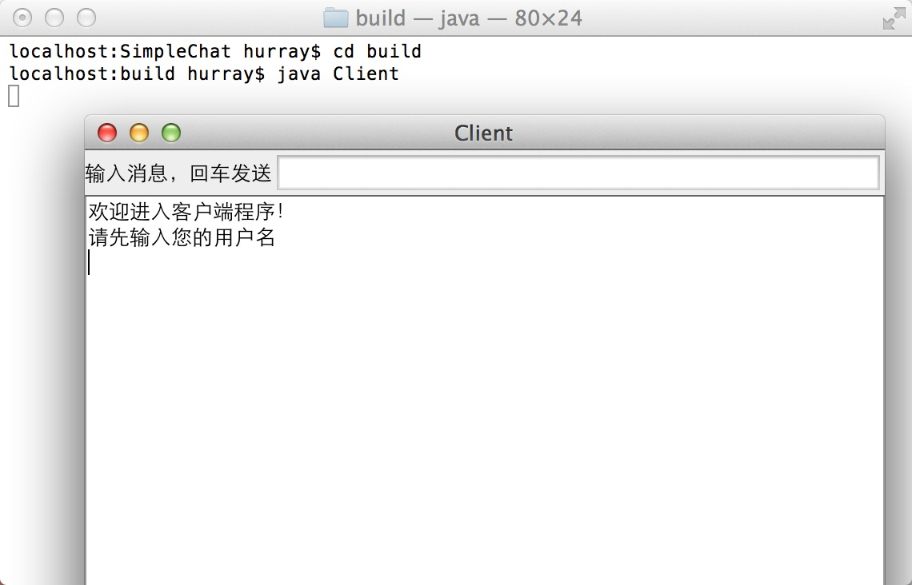

##运行效果

####群聊效果
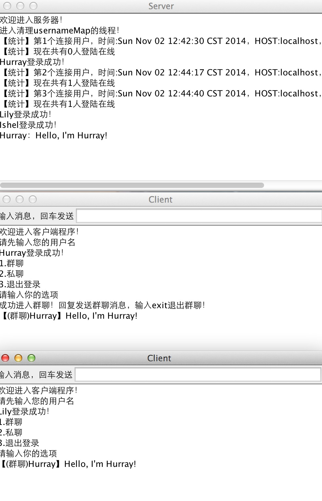
####群聊效果2
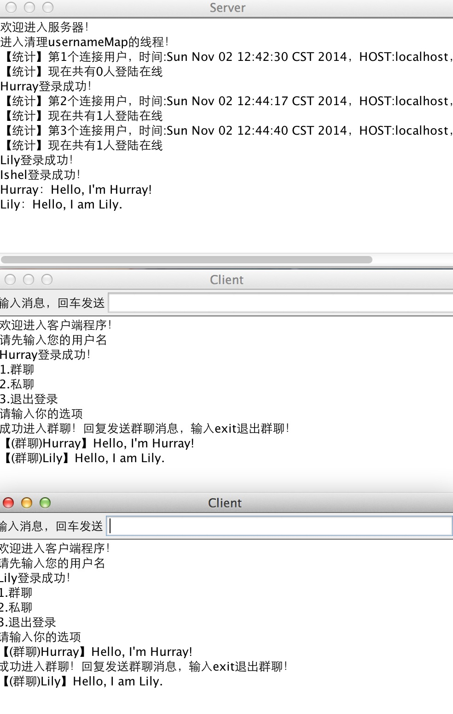

####私聊效果
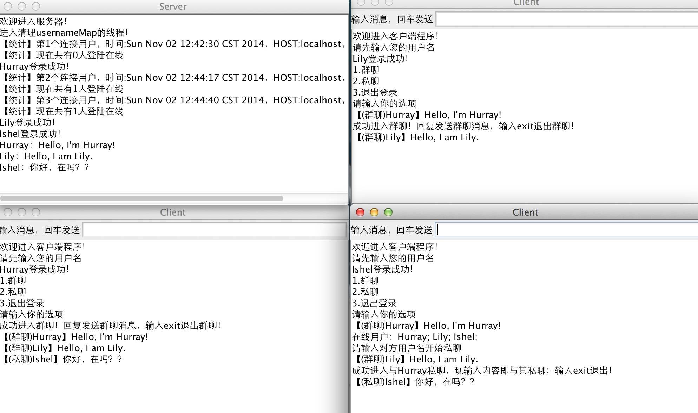

####私聊效果2
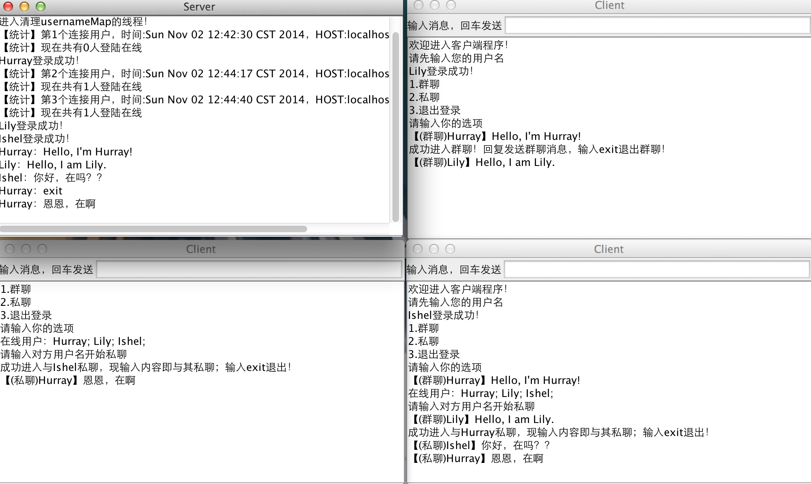

####私聊和群聊同时
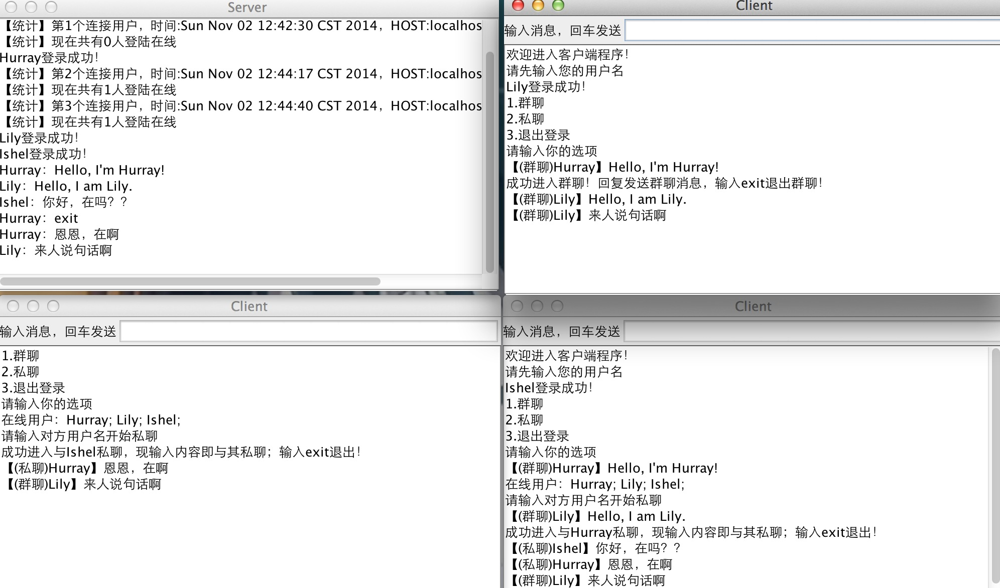

####exit退出当前选择
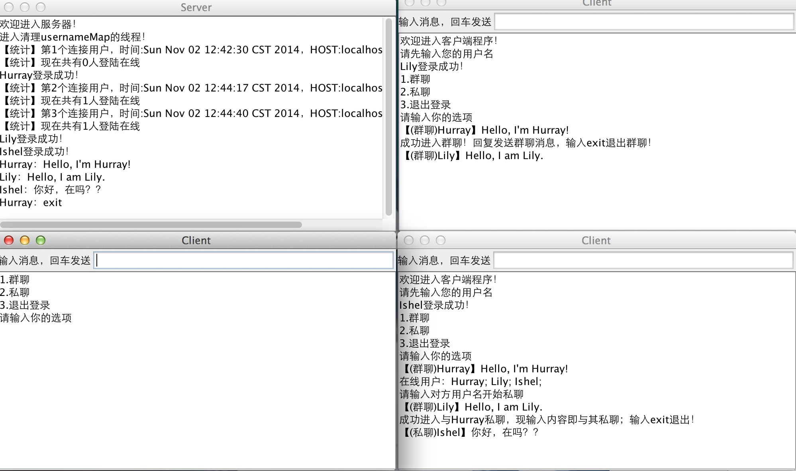

####重新登录
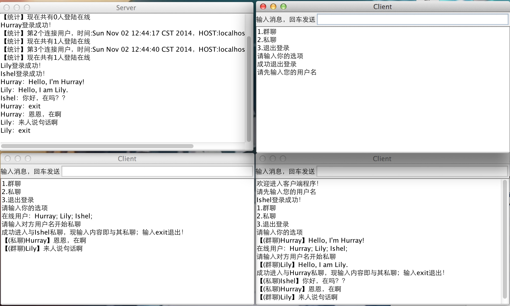