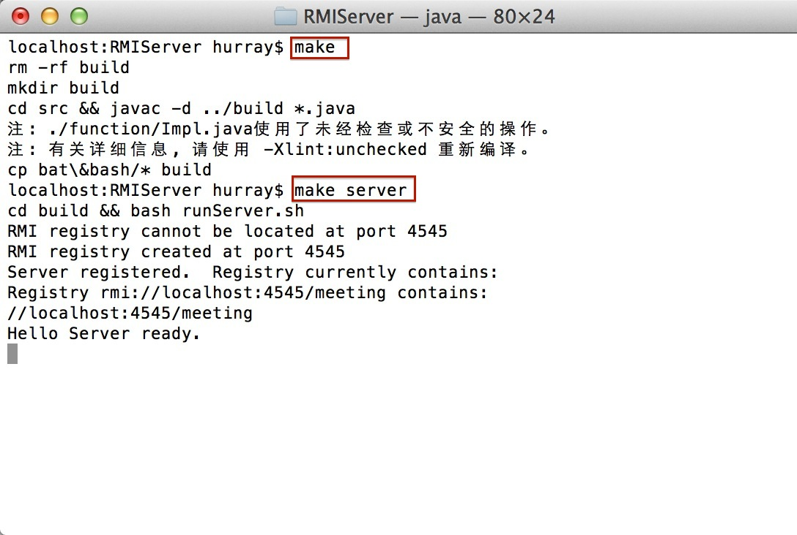
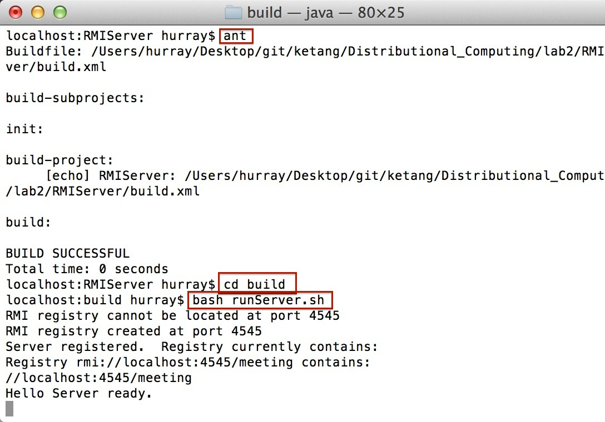
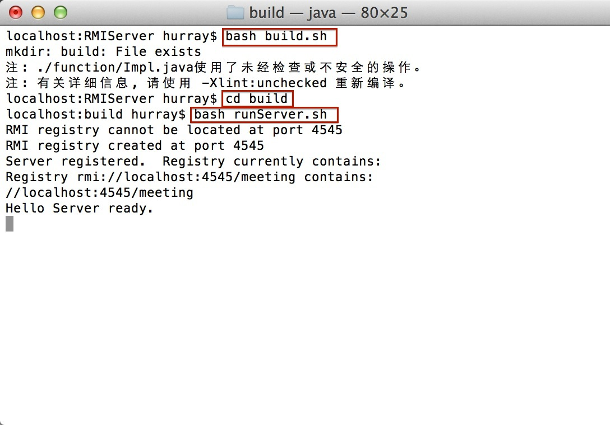
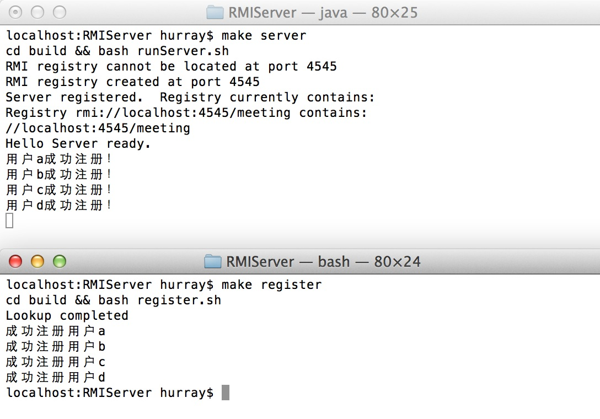
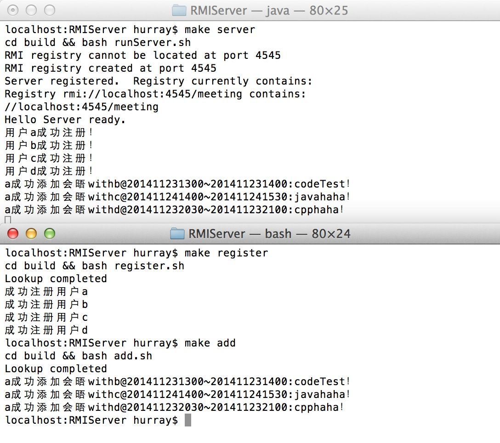
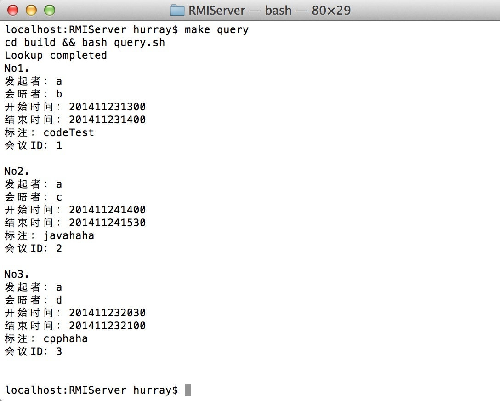
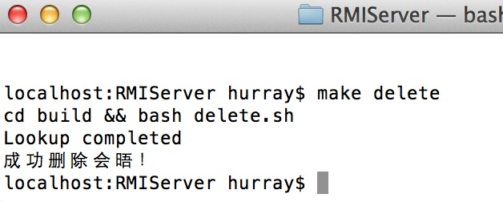
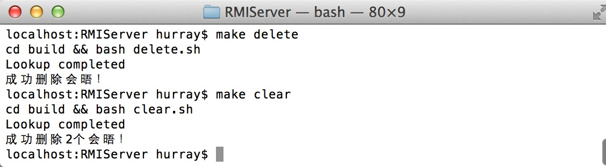
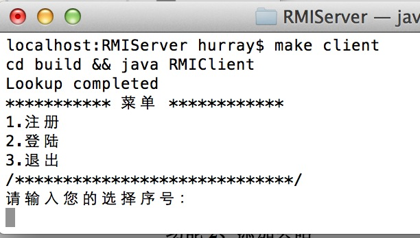
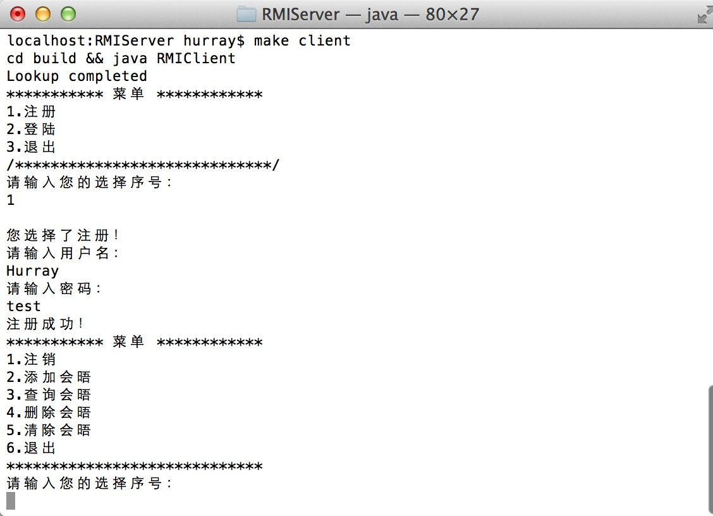

#RMIServer--分布式议程服务
##作者信息
```
Project: RMIServer
Author: Hurray Zhu
Time: 2014.11.22
E-mail: i@ihurray.com
Web-site: http://blog.ihurray.com
GitHub: https://github.com/Hurray0/ketang/tree/master/Distributional_Computing/lab2
```

##文件目录
```
.
|____.classpath
|____.DS_Store
|____.project
|____bat&bash
| |____add.bat
| |____add.sh
| |____clear.bat
| |____clear.sh
| |____delete.bat
| |____delete.sh
| |____query.bat
| |____query.sh
| |____register.bat
| |____register.sh
| |____runServer.bat
| |____runServer.sh
|____build
| |____.DS_Store
| |____add.bat
| |____add.sh
| |____bundle
| | |____Meeting.class
| |____clear.bat
| |____clear.sh
| |____delete.bat
| |____delete.sh
| |____function
| | |____Impl.class
| | |____Interface.class
| |____query.bat
| |____query.sh
| |____register.bat
| |____register.sh
| |____resource
| | |____R.class
| |____RMIClient.class
| |____RMIServer.class
| |____runServer.bat
| |____runServer.sh
|____build.bat
|____build.sh
|____build.xml
|____dist
| |____.DS_Store
| |____javadoc
| | |____allclasses-frame.html
| | |____allclasses-noframe.html
| | |____bundle
| | | |____class-use
| | | | |____Meeting.html
| | | |____Meeting.html
| | | |____package-frame.html
| | | |____package-summary.html
| | | |____package-tree.html
| | | |____package-use.html
| | |____class-use
| | | |____RMIClient.html
| | | |____RMIServer.html
| | |____constant-values.html
| | |____deprecated-list.html
| | |____function
| | | |____class-use
| | | | |____Impl.html
| | | | |____Interface.html
| | | |____Impl.html
| | | |____Interface.html
| | | |____package-frame.html
| | | |____package-summary.html
| | | |____package-tree.html
| | | |____package-use.html
| | |____help-doc.html
| | |____index-files
| | | |____index-1.html
| | | |____index-10.html
| | | |____index-11.html
| | | |____index-12.html
| | | |____index-13.html
| | | |____index-14.html
| | | |____index-15.html
| | | |____index-2.html
| | | |____index-3.html
| | | |____index-4.html
| | | |____index-5.html
| | | |____index-6.html
| | | |____index-7.html
| | | |____index-8.html
| | | |____index-9.html
| | |____index.html
| | |____overview-frame.html
| | |____overview-summary.html
| | |____overview-tree.html
| | |____package-frame.html
| | |____package-list
| | |____package-summary.html
| | |____package-tree.html
| | |____package-use.html
| | |____resource
| | | |____class-use
| | | | |____R.html
| | | |____package-frame.html
| | | |____package-summary.html
| | | |____package-tree.html
| | | |____package-use.html
| | | |____R.html
| | |____RMIClient.html
| | |____RMIServer.html
| | |____script.js
| | |____serialized-form.html
| | |____stylesheet.css
| |____README.TXT
| |____RMIServer.jar
|____doc
| |____.DS_Store
| |____javadoc
| | |____.DS_Store
| | |____allclasses-frame.html
| | |____allclasses-noframe.html
| | |____bundle
| | | |____class-use
| | | | |____Meeting.html
| | | |____Meeting.html
| | | |____package-frame.html
| | | |____package-summary.html
| | | |____package-tree.html
| | | |____package-use.html
| | |____class-use
| | | |____RMIClient.html
| | | |____RMIServer.html
| | |____constant-values.html
| | |____deprecated-list.html
| | |____function
| | | |____class-use
| | | | |____Impl.html
| | | | |____Interface.html
| | | |____Impl.html
| | | |____Interface.html
| | | |____package-frame.html
| | | |____package-summary.html
| | | |____package-tree.html
| | | |____package-use.html
| | |____help-doc.html
| | |____index-files
| | | |____index-1.html
| | | |____index-10.html
| | | |____index-11.html
| | | |____index-12.html
| | | |____index-13.html
| | | |____index-14.html
| | | |____index-15.html
| | | |____index-2.html
| | | |____index-3.html
| | | |____index-4.html
| | | |____index-5.html
| | | |____index-6.html
| | | |____index-7.html
| | | |____index-8.html
| | | |____index-9.html
| | |____index.html
| | |____overview-frame.html
| | |____overview-summary.html
| | |____overview-tree.html
| | |____package-frame.html
| | |____package-list
| | |____package-summary.html
| | |____package-tree.html
| | |____package-use.html
| | |____resource
| | | |____class-use
| | | | |____R.html
| | | |____package-frame.html
| | | |____package-summary.html
| | | |____package-tree.html
| | | |____package-use.html
| | | |____R.html
| | |____RMIClient.html
| | |____RMIServer.html
| | |____script.js
| | |____serialized-form.html
| | |____stylesheet.css
|____makefile
|____manifest.mf
|____nbproject
| |____.DS_Store
| |____build-impl.xml
| |____genfiles.properties
| |____private
| | |____private.properties
| | |____private.xml
| |____project.properties
| |____project.xml
|____readme.txt
|____src
| |____.DS_Store
| |____bundle
| | |____Meeting.java
| |____function
| | |____Impl.java
| | |____Interface.java
| |____resource
| | |____R.java
| |____RMIClient.java
| |____RMIServer.java
```

##编码环境
* MacOS X / Netbeans

##支持环境
* *unix : makefile/ant/bash
* windows : bat/ant
* IDE : Netbeans/Eclipse

##编译运行方法
###1.利用makefile

1. make
2. make server 开启服务器
3. 新建一个窗口，make register; make add; make query; make delete; make clear;执行已经编辑好的命令
。或者执行make client运行客户端

如图：


###2.利用ant

1. ant
2. 定位到build目录中，通过bash命令运行runServer.sh等shell文件

如图：


###3.利用bash

1. bash build.sh
2. 定位到build目录中，通过bash命令运行runServer.sh等shell文件

如图：


###4.利用bat

1. build
2. runServer或register或add等等

###5.手动编译运行

1. mkdir build
2. cd src && javac -d ../build *.java
3. cd build
4. java RMIServer打开服务器
5. java RMIClient打开客户端
6. java RMIClient + 参数 ：预设命令（参考各.bat文件用法）

###6.利用Eclipse/Netbeans

1. 导入项目至IDE中

2. 分别运行RMIServer.java和RMIClient.java对应服务器和客户端

##运行效果
###用户注册


###添加会晤


###查询会晤


###删除会晤


###清除会晤


###客户端1


###客户端2
